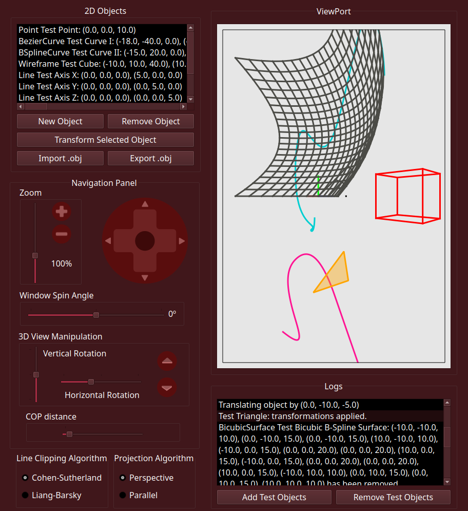

# Sistema Gráfico Interativo - INE5420

Este repositório contém o código fonte do Sistema Gráfico Interativo, desenvolvido ao longo da disciplina de **Computação Gráfica**, a qual foi ministrada pelo professor Aldo Von Wangenheim.

---

## Tarefas Desenvolvidas 📝

O SGI foi feito ao longo de dez trabalhos, cada um correspondendo a novas funcionalidades que deveriam ser implementadas. A seguinte tabela lista todos eles, em ordem de data de entrega. Os autores são [Pedro Henrique Gimenez](https://github.com/pehqge) e [João Vitor Curcio Sutter](https://github.com/JVSutter).

|      Tarefa      |        Descrição         | 
| :--------------: | :----------------------: | 
| [Trabalho 1.1](https://github.com/JVSutter/computacao-grafica/releases/tag/trabalho-1.1) | Desenvolvimento de um Sistema Gráfico Interativo 2D com suporte a window, viewport, panning e zooming, permitindo a exibição e manipulação de pontos, segmentos e polígonos. | 
| [Trabalho 1.2](https://github.com/JVSutter/computacao-grafica/releases/tag/trabalho-1.2) | Expansão do Sistema Gráfico Interativo 2D para suportar translações, escalonamento e rotações arbitrárias utilizando coordenadas homogêneas e uma matriz de transformação genérica.  |
| [Trabalho 1.3](https://github.com/JVSutter/computacao-grafica/releases/tag/trabalho-1.3) | Expansão do Sistema Gráfico Interativo 2D para suportar rotação da janela de visualização e importação e exportação de arquivos .obj.  |
| [Trabalho 1.4](https://github.com/JVSutter/computacao-grafica/releases/tag/trabalho-1.4) | Expansão do Sistema Gráfico Interativo 2D para suportar clipping de polígonos e criação de polígonos aramados ou preenchidos.  |
| [Trabalho 1.5](https://github.com/JVSutter/computacao-grafica/releases/tag/trabalho-1.5) | Expansão do Sistema Gráfico Interativo 2D para suportar curvas de Bézier com blending functions.  |
| [Trabalho 1.6](https://github.com/JVSutter/computacao-grafica/releases/tag/trabalho-1.6) | Expansão do Sistema Gráfico Interativo 2D para inclusão de curvas B-Spline, utilizando Forward Differences para discretização.  |
| [Trabalho 1.7](https://github.com/JVSutter/computacao-grafica/releases/tag/trabalho-1.10) | Modificação do Sistema Gráfico, transitando para o 3D. Projeção ortogonal.  |
| [Trabalho 1.8](https://github.com/JVSutter/computacao-grafica/releases/tag/trabalho-1.10) | Modificação do Sistema Gráfico 3D, suportando projeção em perspectiva.  |
| [Trabalho 1.9](https://github.com/JVSutter/computacao-grafica/releases/tag/trabalho-1.10) | Modificação do Sistema Gráfico 3D, adicionando suporte a superfícies bicúbicas de Bézier.  |
| [Trabalho 1.10](https://github.com/JVSutter/computacao-grafica/releases/tag/trabalho-1.10) | Finalização do sistema gráfico 3D, com suporte a superfícies bicúbicas com diferenças adiante.  |

Todas as entregas foram avaliadas com nota 10, tendo a equipe recebido nota máxima pelo SGI.